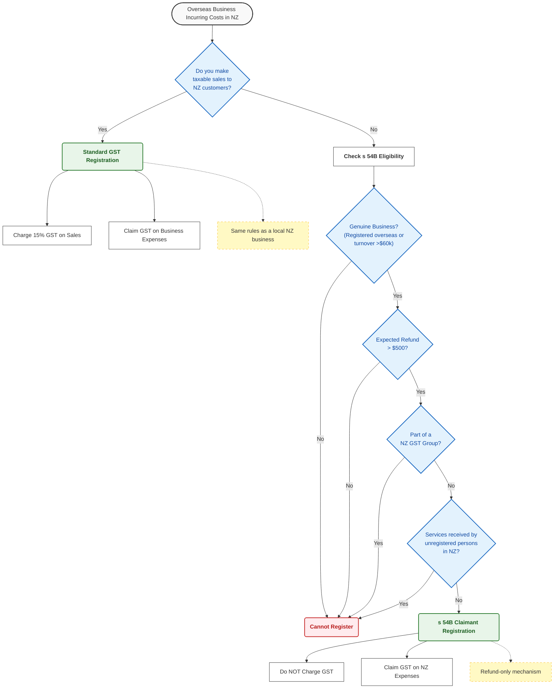
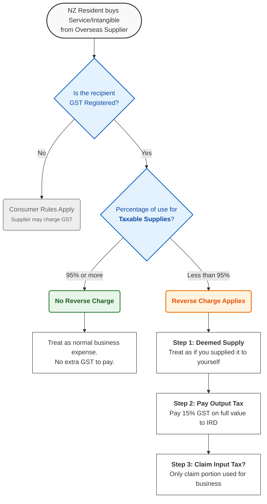
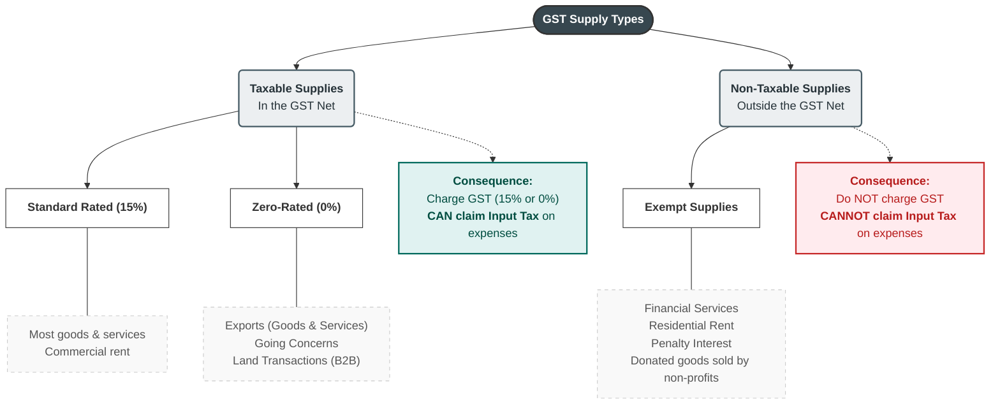

Navigating cross-border GST rules and special supply classifications can be challenging. To assist businesses and practitioners, I have developed visual flowcharts to simplify the complex rules regarding non-resident registration, the reverse charge mechanism, and supply classifications.

These charts are designed to help you quickly determine the correct GST treatment for cross-border transactions and special supply types.

### 1. Overseas Business Registration (Section 54B vs. Standard)

This flowchart helps determine if an overseas business can register for GST in New Zealand, and if so, under which regime.

#### Key Takeaways

- **Standard Registration**: Used when you are **actively selling** in NZ. You collect tax for the government.
- **s 54B Registration**: Used when you are **only spending** in NZ (e.g., conferences, training). You get tax back from the government.

***

### 2. The "Reverse Charge" Mechanism (Imported Services)

This flowchart explains when a New Zealand recipient must pay GST on services or intangibles purchased from overseas suppliers.

#### Example: Mixed Use Scenario

- **Scenario:** An architect buys overseas software for **$100**.
- **Use:** 60% for business (taxable), 40% for private.
- **Result:**
  1. Taxable use (60%) is **less than 95%**.
  2. **Reverse Charge Applies.**
  3. Must pay **$15 GST** (15% of $100) as Output Tax.
  4. Can claim back **$9** (60% of $15) as Input Tax.

***

### 3. Classification of Supplies: Taxable vs. Exempt

This chart clarifies the fundamental difference between Zero-Rated and Exempt supplies.

#### Summary Table

| Feature | Standard Rated (15%) | Zero-Rated (0%) | Exempt Supply |
| :--- | :--- | :--- | :--- |
| **Charge GST to Customer?** | Yes (15%) | No (0%) | No |
| **Is it a "Taxable Supply"?** | Yes | **Yes** | **No** |
| **Can you claim GST on costs?** | **Yes** | **Yes** (Refund likely) | **No** (Cost is higher) |
| **Examples** | Coffee, Consulting, Cars | Exports, Land (B2B) | Bank fees, Home rent |

*Note: These visualisations are based on current NZ GST legislation (GST Act 1985), including section 54B and the reverse charge rules.*